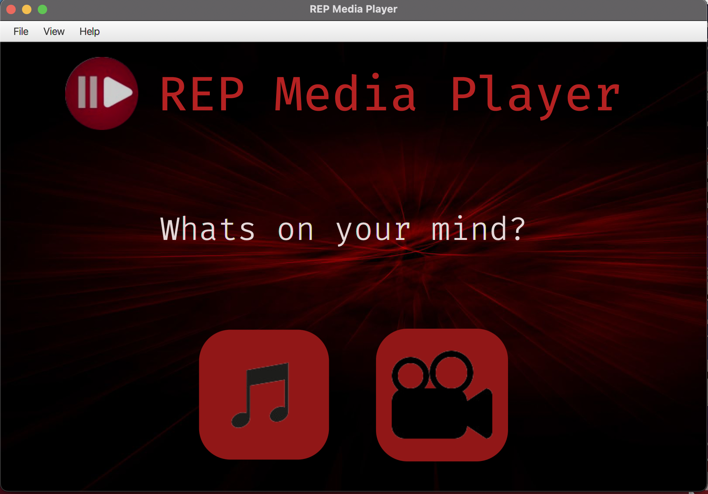

# Media-Player

A simple, elegant media player, to play your movies/songs.etc. One can play any format of audio/video media file, by clicking the right category.

## Requirements

Install [Java](https://openjdk.org/) and [JavaFx](https://openjfx.io/), on your local machine

Clone this repository, either by downloading zip file from Github, or 
```
git clone https://github.com/varun-s22/Media-Player.git
```
or

```
git clone git@github.com:varun-s22/Media-Player.git
```
and now you're good to go.

## How it looks


The opening window of the application


The player window

You can also download the jar file from [here](http://media-player-drab.vercel.app/).
The website is designed using Tailwind CSS. 
